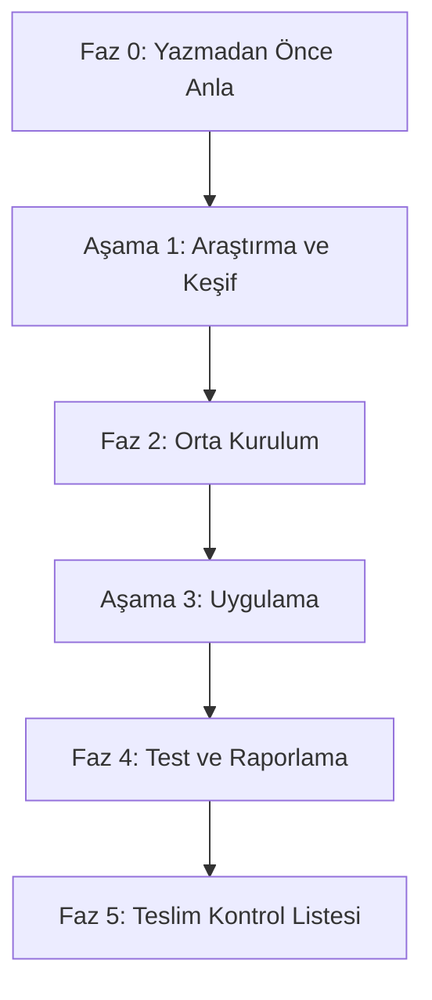

# 🗺️ Öğrenme ve Araştırma Yolculuğu Yol Haritası (ROADMAP)

**Aziz Efe Çırak** tarafından hazırlanan **Rust OWASP Top 10 Security Lab** projesinin gelişim adımlarını ve araştırma metodolojisini detaylandırmaktadır.

---

## 👁️ Yol Haritası Felsefesi (Philosophy)

> 💡 **"Önce anla, sonra kodla."**  
> Büyük ve karmaşık problemleri küçük, sıralı bölümlere ayır. Bir dedektif gibi düşün: gözlemle, ham veriyi çevir, desenleri tespit et, raporla.

---

## ⏱️ Gelişim ve Uygulama Fazları

---

### 🔍 Faz 0: Yazmadan Önce Anla
Kod yazımına geçmeden önce problemin sınırlarını çizme, mimariyi tasarlama ve güvenlik gereksinimlerini belirleme adımıdır.
1. **Problemi Tanımla:** OWASP Top 10 zafiyetlerinin web uygulamasında nasıl konumlanacağını ve derleme zamanı ile çalışma zamanı savunma mekanizmalarının nasıl kurgulanacağını belirle.
2. **Mimariyi Modelle:** Projeyi iş mantığı (`crates/core`) ve HTTP sunucusu (`crates/web`) olarak ikiye bölerek bağımlılık zincirini sadeleştir.
3. **Küçük Parçalara Böl:** Her bir OWASP kategorisini (A01 - A10) kendi içinde bağımsız birer mikro-göreve indirge.

---

### 🔬 Aşama 1: Araştırma ve Keşif (→ [docs/research/](file:///c:/Users/efe/Desktop/Rust-owasp-top10/docs/research/))
Bu aşamada elde edilen teorik bilgiler ve akademik araştırmalar [docs/research/](file:///c:/Users/efe/Desktop/Rust-owasp-top10/docs/research/) dizini altındaki raporlarda belgelenmiştir:
*   **Çift Modlu Canlı Karşılaştırma:** [analiz_cift_mod.md](file:///c:/Users/efe/Desktop/Rust-owasp-top10/docs/research/analiz_cift_mod.md)
*   **Derleme Zamanı Güvenlik Garantileri:** [analiz_derleme_zamani.md](file:///c:/Users/efe/Desktop/Rust-owasp-top10/docs/research/analiz_derleme_zamani.md)
*   **Zamanlama Saldırıları & Parola Güvenliği:** [analiz_timing_attack.md](file:///c:/Users/efe/Desktop/Rust-owasp-top10/docs/research/analiz_timing_attack.md)
*   **Sıfır Disk Sır Yönetimi:** [analiz_zero_disk.md](file:///c:/Users/efe/Desktop/Rust-owasp-top10/docs/research/analiz_zero_disk.md)
*   **DevSecOps & SIEM Altyapısı:** [analiz_devsecops_siem.md](file:///c:/Users/efe/Desktop/Rust-owasp-top10/docs/research/analiz_devsecops_siem.md)

---

### ⚙️ Faz 2: Orta Kurulum
Geliştirme ortamının ve temel bağımlılıkların güvenli standartlara göre kurulması sürecidir.
1. **Rust ve Workspace Yapılandırması:** `Cargo.toml` üzerinde workspace tanımlarını gerçekleştir. Kod optimizasyonu ve binary strip ayarlarını (`[profile.release]`) yap.
2. **Konteyner ve Ağ İzolasyonu:** `Dockerfile` ve `docker-compose.yml` dosyalarını hazırla. Veritabanını dış dünyaya kapatıp yalnızca internal Docker ağında (`backend`) erişilebilir yap.
3. **Güvenli Ortam Şablonu:** `.env.example` şablonunu oluştur. Gizli anahtarların (`SESSION_SECRET` vb.) ve sağlayıcıların (`SECRETS_PROVIDER`) varsayılan ayarlarını belirle.

---

### 🛠️ Aşama 3: Uygulama (Modül Başına ≤10 Adım)

#### 📦 Core Modülü (`crates/core`) Uygulama Adımları:
1. `config.rs` yazarak çevresel değişkenleri ve sır sağlayıcı ayarlarını yükle.
2. `error.rs` ile merkezi ve dışarı sızıntı vermeyen hata yönetimi (`thiserror`) kurgula.
3. `db.rs` ile `sqlx::PgPool` veritabanı bağlantı havuzunu SSL zorunlu olacak şekilde ayarla.
4. `models.rs` altında veritabanı şemasına uygun tip-güvenli Struct yapılarını tanımla.
5. `crypto.rs` modülünde AES-256-GCM, HMAC-SHA256 ve HKDF fonksiyonlarını implement et.
6. `session.rs` ile oturum verilerinin serileştirilmesini ve kriptografik doğrulanmasını yaz.
7. `secrets.rs` altında generic `SecretsProvider` trait tanımını yap.
8. `secrets_aws.rs`, `secrets_vault.rs` ve `secrets_doppler.rs` entegrasyonlarını tamamla.
9. `auth/` altında Argon2id şifreleme ve timing attack engelleyici `dummy_verify` fonksiyonunu yaz.

#### 🌐 Web Modülü (`crates/web`) Uygulama Adımları:
1. `main.rs` dosyasında uygulama ayağa kalkış akışını ve graceful shutdown mekanizmasını yaz.
2. `error_response.rs` ile core hatalarını tarayıcıya yansımayacak güvenli HTTP yanıtlarına dönüştür.
3. `templates.rs` ile Askama şablon yapılarını tanımla ve verileri bağla.
4. `extractors/` altında oturum çerezlerini çözen ve doğrulayan özel `SessionExtractor` yaz.
5. `middleware/security.rs` ile CSP, HSTS, X-Content-Type ve Clickjacking engelleyici başlıkları yaz.
6. `middleware/rate_limit.rs` üzerinde Governor tabanlı IP başı hız sınırlayıcıyı kur.
7. `handlers/auth.rs` ile kayıt, giriş (timing-safe) ve çıkış uç noktalarını yaz.
8. `handlers/idor.rs`, `ssrf.rs` ve `xss.rs` ile sırasıyla IDOR, SSRF ve XSS test sayfalarını implement et.
9. `routes.rs` içinde tüm yönlendirmeleri ve middleware zincirlerini bağla.

---

### 🧪 Faz 4: Test ve Raporlama
Uygulamanın doğruluğunu ve güvenlik kalitesini ampirik olarak test etme aşamasıdır.
1. **Birim ve Entegrasyon Testleri:** `cargo test` çalıştırarak şifreleme, sır yönetimi ve çerez doğrulama testlerini koş.
2. **Çift Mod Entegrasyon Testleri:** Hem `vulnerable` modda zafiyetlerin tetiklendiğini hem de `secure` modda bunların engellendiğini doğrulayan entegrasyon testlerini (`tests/secure_mode.rs`) çalıştır.
3. **Statik Kod Analizi (SAST):** `cargo clippy` ve `cargo audit` taramalarıyla kod kalitesini ve bağımlılık güvenliğini raporla.

---

### 🏁 Faz 5: Teslim Kontrol Listesi
Projenin teslim edilmeye ve canlıya alınmaya hazır olduğunu gösteren kontrol listesi:
- [x] Tüm modüller derleme zamanında başarıyla derleniyor (`cargo check`).
- [x] Birim ve entegrasyon testleri başarıyla tamamlanıyor (`cargo test`).
- [x] `ROADMAP.md` felsefeye ve fazlara uygun şekilde güncellendi.
- [x] Docker yapılandırması (`Dockerfile` & `docker-compose.yml`) non-root yetkileri ve Zero-Trust izolasyonu ile hazır.
- [x] Proje geliştirme ve araştırma raporları `docs/` dizini altında eksiksiz olarak konumlandırıldı.
- [x] Gizli anahtarlar ve veritabanı şablonu `.env.example` içerisinde belgelendi.
