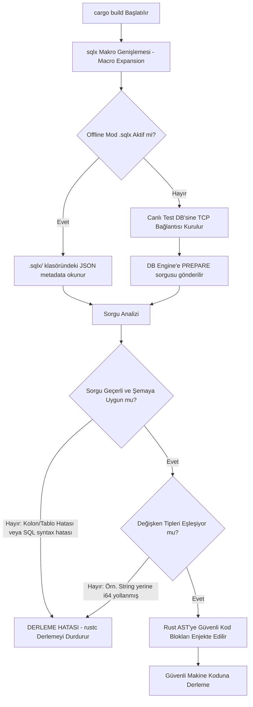

# 🎓 Araştırma Raporu 2: Derleme Zamanı Güvenlik Garantileri (Pillar 2)

Bu çalışmada, **Rust OWASP Top 10 Lab** projesinde uygulanan, güvenlik açıklarının henüz kod derlenme aşamasındayken (compile-time) engellenmesini sağlayan mimari mekanizmalar ele alınmaktadır. 

Geleneksel web framework'lerinde çalışma zamanında (runtime) yakalanan SQL Injection (SQLi) ve Cross-Site Scripting (XSS) zafiyetleri, Rust'ın güçlü makro ve şablon derleme sistemleriyle **derleme aşamasında matematiksel ve yapısal olarak imkansız** hale getirilmiştir.

---

## 💾 1. SQL Injection Engelleme: SQLx Derleme Zamanı Şema Doğrulaması

SQL Injection, kullanıcı girdilerinin SQL parser'ı tarafından bir "komut" olarak yorumlanmasıyla oluşur. Geleneksel yaklaşımlar (PHP, Python, Node.js) girdi temizlemeye (sanitization) veya regex tabanlı engellemelere dayanır ve insan hatasına açıktır.

### SQLx Makro Mekanizması ve AST Analizi

RustSec-analyzer projesinde, kimlik doğrulama ve veritabanı sorguları için `sqlx` kütüphanesinin derleme zamanı doğrulamalı makroları (`sqlx::query!`, `sqlx::query_as!`) kullanılmıştır:

```rust
// auth/secure.rs
let user = sqlx::query_as!(
    User,
    "SELECT id, username, password_hash, email, role, created_at FROM users WHERE username = $1",
    username
)
.fetch_optional(&self.pool)
.await?;
```

Bu makronun derleme aşamasında (`cargo build`) izlediği yol şu şekildedir:



### Bilimsel Novelty (Derleme Zamanı Güvencesi)

1.  **Prepared Statements Zorunluluğu:** `sqlx` makroları, dinamik string birleştirmelerine (SQL string concat) izin vermez. Sorgu içerisinde dinamik girdi yerleştirmek için mutlaka `$1`, `$2` gibi parametre yer tutucuları (placeholder) kullanılmalıdır. Bu parametreler veritabanı motoruna **Prepared Statement (Hazırlanmış Sorgu)** protokolüyle gönderilir.
2.  **Veri ve Komut Ayrımı:** Girdi verileri SQL parser'ından tamamen ayrıştırılarak doğrudan veritabanı yürütme motoruna (execution engine) iletilir. Kullanıcı girdisi `' OR '1'='1` olsa dahi, veritabanı bunu doğrudan bir "kullanıcı adı" string'i olarak aratır, asla komut olarak çalıştırmaz.
3.  **Sıfır Çalışma Zamanı Maliyeti (Zero-Cost Abstraction):** Tüm doğrulamalar derleme zamanında bittiği için, uygulama çalışırken herhangi bir regex arama, SQL parse veya şema doğrulama yükü taşımaz. En yüksek performansta çalışır.

---

## 🎨 2. Cross-Site Scripting (XSS) Savunması: Askama Derleme Zamanı Şablon Derlemesi

Geliştiricilerin en sık yaptığı hatalardan biri, kullanıcıdan alınan verileri HTML sayfasına yazdırırken kaçış karakterlerini (escaping) unutması veya yanlış kaçırmasıdır. Bu durum, saldırganın zararlı JavaScript kodlarını kurbanın tarayıcısında çalıştırmasına (XSS) yol açar.

### Askama HTML Şablon Derleyicisi

Projede kullanılan **Askama** şablon motoru, Jinja2 veya EJS gibi çalışma zamanında HTML yorumlayan sistemlerin aksine, `.html` dosyalarını derleme zamanında parse ederek **saf Rust koduna (struct ve impl) dönüştürür**.

```html
<!-- templates/search.html -->
<p>Arama sonuçları: <strong>{{ query }}</strong></p>
```

Derleme aşamasında Askama, bu şablonu şu mantıkta bir Rust koduna açar:

```rust
// Derleyici tarafından üretilen psödokod representation
impl askama::Template for SearchTemplate {
    fn render_into(&self, writer: &mut dyn std::fmt::Write) -> askama::Result<()> {
        writer.write_str("<p>Arama sonuçları: <strong>")?;
        // Otomatik Kaçış (Auto-Escaping) Aktif
        let escaped_query = askama::filters::escape(&self.query, askama::MarkupDisplay::Html)?;
        writer.write_fmt(format_args!("{}", escaped_query))?;
        writer.write_str("</strong></p>")?;
        Ok(())
    }
}
```

### XSS Savunmasındaki Akademik Katkılar

*   **Derleme Zamanı Tip ve Değişken Kontrolü:** Şablon içinde kullanılan `query` değişkeni, eğer onu çağıracak Rust struct'ı içerisinde tanımlanmamışsa veya tipi uyuşmuyorsa, uygulama derlenemez. Bu, tanımsız değişkenlerden kaynaklanan sunucu çökmelerini (DoS) sıfırlar.
*   **Varsayılan Olarak Güvenli (Secure-by-Default Auto-Escape):** Askama, enjekte edilen tüm verileri varsayılan olarak HTML kaçış süzgecinden geçirir. `<script>` girdisi tarayıcıya `&lt;script&gt;` olarak iletilir. Zararsız bir metin olarak render edilir ve asla execute edilmez.
*   **Bilinçli Bypass Mekanizması:** Geliştirici eğer gerçekten ham HTML yazdırmak istiyorsa (örneğin zengin metin editörleri için), bunu şablonda açıkça belirtmek zorundadır: `{{ content|safe }}`. Bu açık belirteç, kod incelemelerinde (Code Review) güvenlik analistlerinin gözünden kaçmasını imkansız hale getirir.

---

## 📊 Karşılaştırmalı Güvenlik Analizi

| Güvenlik Boyutu | Geleneksel Dinamik Diller (Node/Python/PHP) | Rust (SQLx + Askama) Yaklaşımı |
|---|---|---|
| **SQLi Tespiti** | Çalışma zamanında (Penetrasyon testinde veya sömürüldüğünde) fark edilir. | **Derleme aşamasında** (Hatalı sorgu veya açık içeren string concat derleyici tarafından reddedilir). |
| **XSS Koruması** | Geliştiricinin her ekrana yazdırmada manuel escape fonksiyonu çağırmasına bağlıdır. | **Derleyicinin kendisi** şablonu parse ederken kaçış kodunu otomatik olarak makine koduna ekler. |
| **Performans Maliyeti** | Runtime ORM'leri veya HTML parser'ları ciddi CPU ve RAM tüketir. | **Sıfır çalışma zamanı yükü (Zero-Cost).** Tüm yük derleyicidedir. |
| **Hata Yönetimi** | Hatalı sorgu veya eksik HTML değişkeni runtime'da HTTP 500 veya Crash oluşturur. | Derleme anında hata verir; hatasız çalışmayan bir yazılımın dağıtımı (deployment) fiziksel olarak engellenir. |
